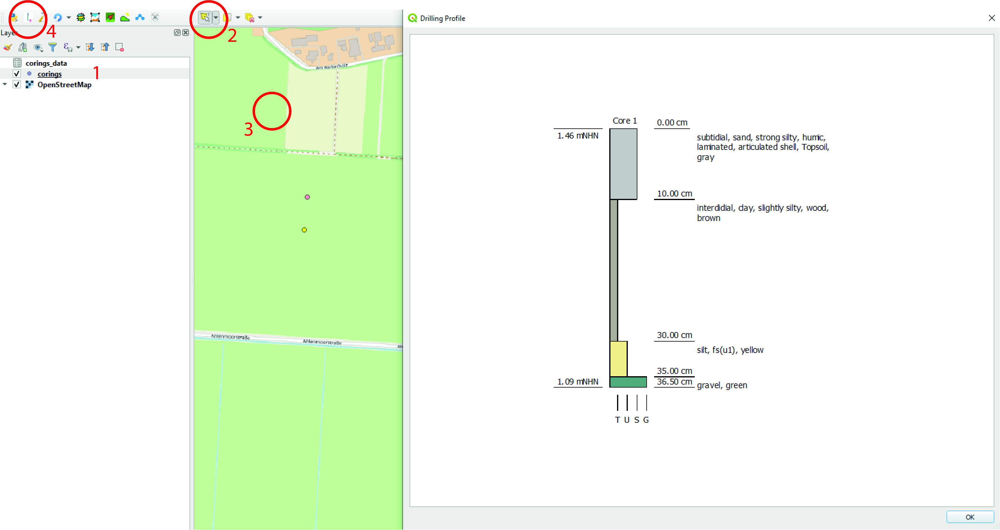
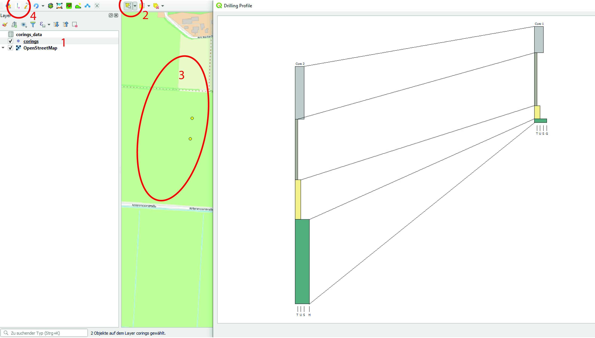
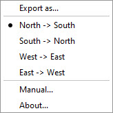

# Summary

In order to be able to interpret drill data correctly and in a comparable manner, the representation of the data as a borehole log (see. Fig. 1) is very important. The geoCore plugin offers the possibility to display and export drilling data from different sources and different disciplines highly flexible in its spatial context. In order to be able to draw the data, only the spatial data of the boreholes and the data of the individual strata are required. These are given according to a fixed definition. In order to do justice to the use of different signatures, the specific description of the layers can be defined in a yml file and thus adapted. The cores can be displayed individually or as transects with layer grouping. geoCore thus represents a significant improvement in the evaluation and processing options for coring in multidisciplinary projects.

The plugin is developed in Python by [T-Systems on site services GmbH](https://www.t-systems-onsite.de/) in content cooperation with the [Lower Saxony Institute for Historical Coastal Research](https://nihk.de/en/) and is dependant of the Quantum GIS framework.

# Statement of need 

Drilling in the ground and the associated descriptions and evaluations are carried out by a wide variety of specialist disciplines. These include geology, soil science, archeology, engineering, etc.. In all cases, the layers of the cores are documented and the borehole logs are graphically converted. This implementation is crucial for a comparable interpretation of the data. Usually fixed definitions are used for the descriptions of the layers, but these change according to the different disciplines and regions [e.g.: @garrison:2003; @agboden:2005; @aggeologie:2008; @fao:2015]. A detailed consideration of the graphic implementation is very important for the evaluation of the boreholes. Various proprietary programs are available for this purpose, but they usually only meet the requirements of a narrow group of scientists and cannot be adapted. This leads to difficulties, especially in interdisciplinary projects, and in the case of mandatory standards between different regions. It means a lot of work when transforming the data. Furthermore, the programs for displaying the cores only have very limited GIS functionalities; so that it is only possible to a limited extend to mix them with other data sets (archaeological maps, topology, topography, etc.). To simplify this, the plugin geoCore was developed in the QGIS environment @qgis:2020. Therefore, it is possible to use the functionalities available in a complex geographic information system. The plugin should offer the possibility of being able to display recorded data flexibly.

# Workflow

## Data

The data to be presented are loaded into QGIS in two layers. On the one hand, there is the drilling data with the location and name of the individual drilling and a layer with the individual strata. The data record with the boreholes should correspond to the following format. The names of the columns can be adjusted in the config.yml in the plugin folder. The coordinates must be in a geographic coordinate system with a metric scale:

ID |	xcoord |	ycoord |	zcoord |	name | 
| --- |-------------|-------------|-------------|-------------|
1 |	32485574.7100 |	5949969,4730 |	1.459 |	core 1
2 |	32485583.1799 |	5950059.7089 |	1.308 |	core 2
3 |	32485604.7038 |	5950117.1169 |	1.400 |	core 3
Table: Layername: Exampledata

A text file is also required in which the data on the individual layers of the boreholes are available (layer data). To define the name of the text file, that will be used with the main file you have to define it by name it like the main table, extended by *_data* . The content of the columns petrography, description and color are used to define the display of the profiles and are linked to *geoCore.yml* in the plugin folder, the adaptation of which is defined in the following section. The description follows the definition of @aggeologie:2008. 
The layer data has to be structured as follows, but it is possible to change the column names in the config.yml. The ID corresponds to the ID in the master data table:

ID |	layerno |	petrography |	facies |	comment |	colour |	depth_from |	depth_to |	group
| --- |-------------|-------------|-------------|-------------|-------------|-------------|-------------|-------------|
1 |	1 |	S(u4, h, lam, as) |	st ||		gr |	0 |	10 |	1
1 |	2 |	T(u1, wood) |	it ||		br |      	10 	| 30 |	2
1 |	3 |	U(fs) ||		|	ge |              	30 |	35 |	3
1 |	4 |	G 		|||	gru |	                  35 |	36.5 |	4
2 |	1 |	S(u2) |||			gr |              	0 |	20 |	1
2 |	2 |	T 		|||	br |	                  20 |	43 |	2
2 |	3 |	U(t1) |||			ge |              	43 |	58 |	3
2 |	4 |	H 		|||	gru |	                  58 |	90 |	4
3 |	1 |	S(u2) |||			gr |              	0 |	20 |	1
3 |	2 |	T 		|||	br |	                  20 |	43 |	2
3 |	3 |	U(t1) |||			ge |              	43 |	58 |	3
3 |	4 |	H 		|||	gru |	                  58 |	90 |	4
Table: Layername: Exampledata_data

*    ID -> Key value that is also available in the drilling table
*    layerno -> layernumber (unique per hole)
*    petrography -> description of the soil layer. Style after @aggeologie:2008. The definition is determined by the *geoCore.yml* (see below)
*    facies -> only for the description text
*    comment -> is used in addition to the description of the layer on the drilling profile
*    colour -> Description of the color of the layer. The definition is determined by the *geoCore.yml* (see below)
*    depth_from -> Top of the layer in centimeters below the terrain surface
*    depth_to -> Lower edge of the layer in centimeters below the terrain surface
*    group -> Value for grouping layers of different profiles (acre in profile 1 corresponds to acre in profile 2) 

## Define the Layout
The layout is defined by *geoCore.yml* in the plugin directory. This is divided into three parts (*boxes*, *description* and *color*). Using these definitions the layer data can be visualized as borehole logs.

### boxes
In  `boxes`, the width of the boxes that represent a layer is defined based on the entry in *petrography*. In this step, the value that is not in brackets is used. `longname` is used for the entry in the description field next to the layer of the profile.


ID |	layerno |	petrography
| --- |-------------|-------------
1 |	1 |	**S**(u4, h, lam, as)

In the yml file, the abbreviation is used to define the real name, which can be found in the description, and the width of the box.


```{yaml}
boxes:
    S: #shortname
        longname: sand
        width: 1.5
    T: #shortname
        longname: clay
        width: 1.0
```

### description

The `description` field is also defined by the *petrography* column, but the values in the brackets are used here. Their definition can also be found in *geoCore.yml*. `longname` defines the text module that is displayed next to the profile in the description field. `texture` contains the link to .svg vector graphics, which are stored in the symbols subdirectory.

ID |	layerno |	petrography
| --- |-------------|-------------
1 |	1 |	S**(u4, h, lam, as)**

```{yaml}

descriptions:
    u4: #shortname
        longname: strong silty
    h: #shortname
        longname: humic
    fs: #shortname
        longname: fine sand
    lam: #shortname
        longname: laminated
        texture: symbols/lam.svg
    as: #shortname
        longname: articulated shell
        
```

### colors
Also defined by the geoCore.yml is the *color* in which the respective box is displayed. Not shown, but `longname` is available for better traceability. In the field `code` the RGB value of the respective color is given. Predefined colors from color charts can also be used.

ID |	layerno |	color
| --- |-------------|-------------
1 |	1 |	**gr**

```{yaml}

colors:
    gr: #shortname
        longname: gray
        code: "#c9c8c8"
    br: #shortname
        longname: brown
        code: "#b6afa1"
        
```

## Usage
If all files are available as described and the definitions are entered as required, the plug-in can be used. First, the shape file and the corresponding text file with the layer data must be imported. It is now possible to display a single or multiple profiles. To do this, select all the desired boreholes with the QGIS Selection Tool and click on the geoCore icon (or choose the menu entry Plugins -> geoCore -> Show drilling profile) (Fig. 1, 2). A dialog opens showing the drilling profile(s). geoCore’s user interface is kept very simple and should be self-explanatory. **A right click on the dialog** opens the context menu (Fig. 3) which allows to export the profile as an SVG and do further setup. Furthermore you can rearrange the drilling profiles if you are showing multiple at once. If the *group* parameter contains an entry for several profiles, the layers are automatically connected. Using the mouse wheel you can zoom in and out. The middle mouse button allows for panning. This is just like navigating the QGIS map.


## Example

###Example 1: Single core

1. Select the correct layer
2. Select the selection tool
3. Select a coring
4. Click the *geoCore*-Symbol



###Example 2: Multi cores

1. Select the correct layer
2. Select the selection tool
3. Select more than one coring
4. Click the *geoCore*-Symbol

You can change the direction of the transect if the drawing is incorrect (Fig. 3).






# Installation
The plugin is available in the [QGIS extension manager](https://plugins.qgis.org/plugins/geoCore) or you can download the develpoment version of the plugin at [github](https://github.com/t-systems-on-site-services-gmbh/geoCore). 

# Additional information
The plugin is still under development - see [issues](https://github.com/t-systems-on-site-services-gmbh/geoCore/issues)
 

# Acknowledgements

We acknowledge contributions from Martina Karle (NIhK Wilhelmshaven).

# References